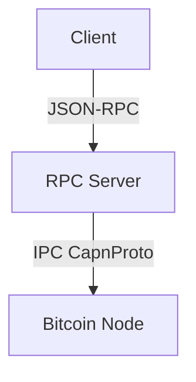
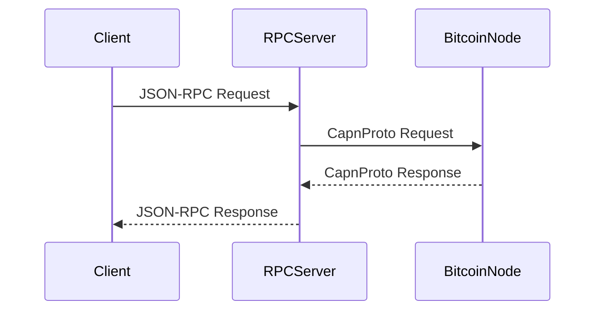

# Bitcoin RPC Multiprocess Server <br>
An HTTP server written in C++ that provides JSON-RPC access to the Bitcoin multiprocess components using Cap'n Proto IPC (Inter-Process Communication). It acts as an intermediary between the HTTP client and the bitcoin-node by hiding the complexities of IPC. 
<h1> Overview </h1> 

This RPC server connects to a Bitcoin node via a **Unix domain socket** using **Cap’n Proto** for IPC and exposes a **JSON-RPC HTTP interface** for clients to interact with the `bitcoin-node`.
The server is designed to be compatible with the current Bitcoin Core architecture, utilizing the same libraries for JSON parsing, asynchronous networking, and event-driven operations. Hence, it uses:

- **[Univalue](https://github.com/jgarzik/univalue)** for JSON parsing and construction.
- **[Libevent](https://github.com/libevent/libevent)** for handling asynchronous networking and event-driven I/O tasks.

The main idea and design for multiprocess in Bitcoin can be found [here](https://github.com/ryanofsky/bitcoin/blob/pr/ipc/doc/design/multiprocess.md). It uses [libmultiprocess](https://github.com/bitcoin-core/libmultiprocess) library for spawning worker processes and handling Bitcoin RPC calls via Cap’n Proto messages.
<br>
<h2>Requirements </h2>

- **[libmultiprocess](https://github.com/bitcoin-core/libmultiprocess)**
- **[Cap'n Proto](https://capnproto.org/)**
- **[Univalue](https://github.com/jgarzik/univalue)**
- **[Libevent](https://github.com/libevent/libevent)**
- **C++20 compatible compiler**
<h2> Building Dependencies</h2> 

It also uses the new chain interface, introduced in the [PR#29409](https://github.com/bitcoin/bitcoin/pull/29409), which added several RPC methods that we can use for making calls. <br/>

```sh
#libevent
sudo apt-get install build-essential cmake libevent-dev

# Cap'n Proto
wget https://capnproto.org/capnproto-c++-1.0.1.tar.gz
tar zxf capnproto-c++-1.0.1.tar.gz
cd capnproto-c++-1.0.1
./configure
make -j$(nproc)
sudo make install

# libmultiprocess
# you don't need to download Cap'n Proto again here as you already download above through source code
mkdir build
cd build
cmake ..
make
make check # Optionally build and run tests
make install

#Univalue
git clone https://github.com/jgarzik/univalue.git
cd univalue
./autogen.sh
./configure
make

# Fetching PR#29409
git remote add [NAME] https://github.com/ryanofsky/bitcoin.git
git fetch [NAME]
git checkout pr/ipc-chain
```
Now you can refer to Bitcoin core multiprocess [doc](https://github.com/bitcoin/bitcoin/blob/master/doc/multiprocess.md) to build the bitcoin as a multiprocess.
Generally, you can build just by providing these commands if you followed the above steps correctly.

```sh
# This will only work if you have downloaded libmultiprocess and Cap'n Proto system widely.
cd <BITCOIN_SOURCE_DIRECTORY>
make -C depends NO_QT=1 MULTIPROCESS=1
cmake -B build -DWITH_MULTIPROCESS=ON
cmake --build build
```

<h2>Usage</h2> 
<h3>Building the RPC Server</h3>
The RPC server already contains all the necessary Cap'n Proto generated files, so you don't have to generate them explicitly, but if you want to use your own files, then just copy and paste the generated files in the Bitcoin repo found in build/src/ipc/capnp to bitcoin-rpc-multiprocess/src/ipc. The Bitcoin repo only generates the Cap'n Proto files if you compiled your code with multiprocess on.<br/>
<br>

**Note:** Always make sure you have downloaded the same version of the Cap'n Proto compiler while generating and running your code. Otherwise you will face some errors in Cap'n Proto generated files. `"Version mismatch between generated code and library headers. You must use the same version of the Cap'n Proto compiler and library."`. In short, the Cap'n Proto code generated in Bitcoin Core `build/src/ipc/capnp` and `bitcoin-rpc-multiprocess/src/ipc` must be the same.

```sh
#Clone the repository
cd bitcoin-rpc-multiprocess
mkdir build
cd build
cmake ..
make VERBOSE=1
```

<h3>Running the bitcoin node</h3>

```sh
# You can change the -ipcbind parameter to any name and location you prefer.
cd build
./src/bitcoin-node -regtest -ipcbind=unix:/tmp/bitcoin-ipc.sock -printtoconsole
# This will start the bitcoin-node process which is ready to listen for any IPC requests and act upon those.
```

<h3>Running the Server</h3>

```sh
./rpc-server [options]

Options:
  --socket, -s <path>     Path to Bitcoin IPC Unix socket (default: /tmp/bitcoin-ipc.sock)
  --address, -a <address> HTTP server bind address (default: 127.0.0.1)
  --port, -p <port>       HTTP server port (default: 8332)
```
**Example**

```sh
# the --socket argument must be the same as you provided above in bitcoin-node -ipcbind option
./rpc-server --socket /tmp/bitcoin-ipc.sock --address 127.0.0.1 --port 8332
# This will start the server which listens on the provided address and binds to the specified unix port 
```

<h2>JSON-RPC API</h2>
The server implements a subset of the Bitcoin Core RPC API. All requests should be POST requests with `JSON-RPC` formatted bodies:<br/><br>


```ruby
{
  "method": "methodname",
  "params": [param1, param2, ...],
  "id": 1
}
```

**<h3>Supported Methods</h3>**

<h3>getblockhash</h3>
Returns the block hash at the given height.

 **Parameters:**

- height (int): The block height

```ruby
{
  "method": "getblockhash",
  "params": [1],
  "id": 1
}
```

**Response:**

```ruby
{
  "result": "00000000839a8e6886ab5951d76f411475428afc90947ee320161bbf18eb6048",
  "error": null, [optional]
  "id": 1
}
```

<h3>initmessage</h3>
Sends an initialization message to the Bitcoin node.

**Parameters:**

- message (string): The message to send
  
```ruby
  {
  "method": "initmessage",
  "params": ["Hello Bitcoin node"],
  "id": 1
  }
```

**Response:**

```ruby
{
  "result": "Message sent successfully",
  "error": null,
  "id": 1
}
```

<h3>Sending request using curl</h3>

Get a Block Hash:
 
```ruby
curl -X POST \
  http://127.0.0.1:8332 \
  -H "Content-Type: application/json" \
  -d '{
    "method": "getblockhash", 
    "params": [1], 
    "id": 1
  }'
```

**Output:**

```sh
{"result":"3091be15fb092d5d9d6af6793a89d6b9da8a74ef584675464abb2c51dbbd213d","id":1}
```

Sending an Init Message:

```ruby
curl -X POST \
  http://127.0.0.1:8332 \
  -H "Content-Type: application/json" \
  -d '{
    "method": "initmessage", 
    "params": ["Hello Bitcoin Node"], 
    "id": 2
  }'
```

**Output**

```sh
{"result":"Message sent successfully","id":2}
```

<h3>Cap'n Proto request received on bitcoin-node </h3> 

```sh
2025-04-02T15:42:18Z [ipc] {bitcoin-node-1419700/b-capnp-loop-1419712} IPC server recv request  #1 Init.construct$Params ()
2025-04-02T15:42:18Z [ipc] {bitcoin-node-1419700/b-capnp-loop-1419712} IPC server send response #1 Init.construct$Results (threadMap = <external capability>)
2025-04-02T15:42:18Z [ipc] {bitcoin-node-1419700/b-capnp-loop-1419712} IPC server recv request  #2 Init.makeChain$Params (context = (thread = <external capability>))
2025-04-02T15:42:18Z [ipc] {bitcoin-node-1419700/b-capnp-loop-1419712} IPC server post request  #2 {bitcoin-node-1419700/b-capnp-loop-1420123 (from )}
2025-04-02T15:42:18Z [ipc] {bitcoin-node-1419700/b-capnp-loop-1419712} IPC server send response #2 Init.makeChain$Results (result = <external capability>)
2025-04-02T15:42:22Z [ipc] {bitcoin-node-1419700/b-capnp-loop-1419712} IPC server recv request  #3 Chain.initMessage$Params (context = (thread = <external capability>), message = "Hello Bitcoin Node")
2025-04-02T15:42:22Z [ipc] {bitcoin-node-1419700/b-capnp-loop-1419712} IPC server post request  #3 {bitcoin-node-1419700/b-capnp-loop-1420123 (from )}
2025-04-02T15:42:22Z init message: Hello Bitcoin Node
2025-04-02T15:42:22Z [ipc] {bitcoin-node-1419700/b-capnp-loop-1419712} IPC server send response #3 Chain.initMessage$Results ()
```

```sh
2025-04-02T15:43:18Z [ipc] {bitcoin-node-1419700/b-capnp-loop-1419712} IPC server recv request  #4 Chain.getBlockHash$Params (context = (thread = <external capability>), height = 1)
2025-04-02T15:43:18Z [ipc] {bitcoin-node-1419700/b-capnp-loop-1419712} IPC server post request  #4 {bitcoin-node-1419700/b-capnp-loop-1420123 (from )}
2025-04-02T15:43:18Z [ipc] {bitcoin-node-1419700/b-capnp-loop-1419712} IPC server send response #4 Chain.getBlockHash$Results (result = "=!\\275\\333Q,\\273JFuFX\\357t\\212\\332\\271\\326\\211:y\\366j\\235]-\\t\\373\\025\\276\\2210")
```

<h2>Architecture</h2>
<h3>Block Diagram </h3>



<h3>Sequence Diagram </h3> 


<h3>Future Improvements</h3>
Currently, this RPC server supports a limited number of RPC methods. I plan to gradually expand its functionality by adding more RPC methods over time.
